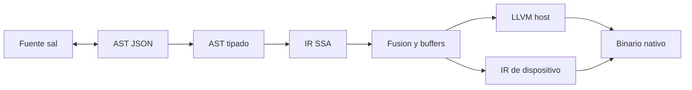
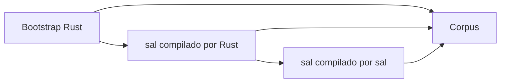

# Lenguaje sal

Los subplanes de [docs/subplans/](docs/subplans/) son la especificación de implementación. Cada uno recibe la salida del anterior y fija archivos, algoritmo y tests. La gramática normativa, recursiva por la izquierda, está en [SPEC.md](SPEC.md) y en [docs/subplans/01-spec-surface.md](docs/subplans/01-spec-surface.md). El código de [src/](src/) es el arranque: donde un pase esté incompleto, manda el subplan.

Los siete subplanes del compilador, en este orden:

1. **Especificación y superficie.** Gramática recursiva por la izquierda, tipos, memoria, efectos, lugares, operaciones de tensor, contenedor `.salt` y la lista cerrada de códigos de error. También qué queda descrito pero fuera del arranque (`parallel`, arenas, `@shared`, diferenciación automática, registro de paquetes).
2. **Frontend y agentes.** Lexer de layout, parser que construye el árbol de esa gramática, AST, spans, formateador idempotente y el esquema JSON versionado de ida y vuelta.
3. **Semántica.** Inferencia, ownership, escape, efectos, formas, lugares y el texto estructurado de los diagnósticos.
4. **IR, fusión y runtime.** SSA, fusión, `peak_bytes`, heaps por actor, primitivas `matmul` y `softmax`, `load`, `E_OOM` y la bajada a LLVM con Clang `-O0` y `-O3`.
5. **Instrumentación.** Sondas, cuarentena, zonas rojas y los eventos `LEAK`, `OOB`, `USE_AFTER_FREE`, `DOUBLE_FREE`, `BAD_PLACE`, `NAN` e `INF`.
6. **Herramientas.** CLI `sal`, `Sal.toml`, módulos e invalidación de la caché en `target/`.
7. **Autohospedaje.** Preludio, ejemplos, tests de ejecución y el criterio de las tres cadenas sobre [selfhost/](selfhost/).

La extensión de editor no entra en esa cadena. Es un octavo subplan, [docs/subplans/08-vscode.md](docs/subplans/08-vscode.md), y puede empezar cuando `sal check --error-format json` y `sal fmt` existan. No bloquea el autohospedaje ni reimplementa el compilador.

Compilador nativo en este repositorio. El primer compilador se escribe en Rust (ya instalado) y sirve de arranque. La validación del lenguaje es otro compilador, escrito en sal, que se compila a sí mismo y usa las capacidades del lenguaje. El host genera LLVM IR textual y Clang 18 lo compila con `-O3` en release. CPU, GPU y TPU son actores del propio lenguaje: el lugar del dato forma parte del tipo y el compilador hace la reserva, la copia y el lanzamiento. La velocidad de ejecución manda, y el caso que el compilador afina es el pase hacia adelante de un modelo: fusión, tipos estrechos, pocos viajes a memoria y un backend interno para las operaciones calientes. Valores en pila, moves, sin recolector de basura y sin comprobaciones de desbordamiento aritmético. El modo de instrumentación es opcional y explícito, porque cambia el coste. La compilación se mantiene rápida con una gramática pequeña, sin macros y con caché incremental por módulo.

## Filosofía cerrada

Hacer implícito solo lo que el compilador puede demostrar. Hacer explícito lo que cambia el comportamiento observable o el coste: consumo de un valor, efectos, layout, heap, compartir y el lugar donde viven los datos (cpu, gpu o tpu).

Una sola forma canónica por concepto. El formateador es obligatorio y el compilador acepta el mismo árbol que imprime.

Pipeline oficial para agentes, con esquema versionado:

```text
fuente ↔ AST ↔ AST tipado ↔ IR ↔ fusión ↔ host LLVM / dispositivo
```

Los agentes leen y escriben el AST en JSON (`sal emit ast`, `sal compile --ast`). El formateador vuelve a texto. Los lifetimes no aparecen en la fuente; sí en el AST tipado, como dato interno.



## Modelo de memoria

Cada binding recibe, por inferencia, una residencia y una capacidad. El programador no escribe lifetimes.

- Residencia: `stack` por defecto en cpu. `heap` solo para `String`, `List[T]`, tipos recursivos o un valor que tiene que sobrevivir sin un dueño único en pila. `@stack` convierte una promoción a heap en error. Un `Tensor` vive además en un lugar: `cpu`, `gpu` o `tpu`.
- Capacidad: `copy` si el tipo es trivial (`Int`, `Float`, `Bool` y structs cuyos campos lo son). Si no, `unique` y se mueve. Un préstamo dura solo el argumento de una llamada; no hay locales de tipo referencia en el código normal.
- Mutación in situ del dueño único, como en `user.name = "Ana"`. Los bindings nacen mutables. `@frozen` es la excepción explícita.
- Si un préstamo tendría que guardarse o devolverse, el compilador no inventa un lifetime en la API: pide devolver el valor por movimiento, o anotar `@shared` (conteo de referencias atómico, fase posterior).
- `@resource` impide destruir el valor sin consumirlo (ficheros, sockets). El drop implícito del resto de tipos sí existe.
- `@layout(c)` fija orden y ABI C. Sin esa anotación el compilador elige el layout.
- Compartir entre tareas exige `@copy` o mover el valor. No hay alias mutable compartido.

La inferencia es léxica y por sentencia: más predecible y más barata de compilar que non-lexical lifetimes. El AST tipado publica `borrow` o `take` en cada parámetro, inferido del cuerpo. `sal fmt` lo escribe en las firmas públicas para que no cambie en silencio.

Aritmética con wrap definido, siempre. Suma comprobada solo vía `checked_add` → `Result`. Los accesos a `List` sí comprueban límites: eso es seguridad de memoria, no un coste opcional.

## CPU, GPU y TPU

Los tres son actores del lenguaje, al mismo nivel. Un programa no importa CUDA, ROCm, Metal, XLA ni una librería de tensores: el lugar forma parte del tipo y el compilador es quien reserva la memoria del dispositivo, mueve los datos y lanza el trabajo.

Hay una sola construcción, `on`:

```sal
fn scale(m: Tensor[F32, 2, 2] on p) -> Tensor[F32, 2, 2] on p
    on p
        map(m, x => x * 2.0)

fn main() -> Int ! gpu
    host = tensor[[1.0, 2.0], [3.0, 4.0]]
    dev = to gpu host
    back = to cpu scale(dev)
    0
```

- `Tensor[T] on p` guarda el lugar en el tipo. `p` se infiere del argumento en la llamada (`cpu`, `gpu` o `tpu`). Si hay ambigüedad, el `to` del sitio de llamada la cierra.
- `to gpu` y `to tpu` son la única transferencia. Es una copia entre memorias distintas, así que el coste queda escrito. Si ese uso es el último, el compilador libera el origen. Mezclar lugares sin `to` es el error `E_PLACE`. El compilador no inserta copias ocultas host↔dispositivo.
- Dentro de `on gpu` u `on tpu`, los agregados libres tienen que estar ya en ese lugar. Los escalares `copy` (`Int`, `Float`, `Bool`) entran por valor.
- La vía canónica, válida en los tres actores, son las operaciones de tensor del lenguaje. Dentro de un `on` el compilador las fusiona, como se describe en la sección de modelos.
- La vía de sistemas en GPU es `on gpu kernel`, con índice explícito. En `tpu` esa forma es `E_DEVICE`: la TPU solo ejecuta la vía masiva.
- Lanzar trabajo en un dispositivo es un efecto (`! gpu`, `! tpu`), igual que `io` o `alloc`. `sal fmt` lo escribe en la firma.

En la IR, cada tensor lleva su lugar y aparecen `place_copy`, `on_device` y las operaciones masivas. El runtime del lenguaje tiene un heap distinto por actor. `sal run` ejecuta esos bloques en ese heap: los tests comprueban resultados y que no hay copias implícitas aunque la máquina no tenga GPU ni TPU. `sal build --device gpu` y `--device tpu` eligen el controlador nativo compilado dentro de `sal`, no un paquete que el usuario enlaza. Si el dispositivo o su toolchain no están, el error es `E_DEVICE_MISSING`; `sal check` sigue aceptando el programa.

## Ejecución de modelos

Un modelo es código sal: los pesos son tensores y el pase hacia adelante es una función. No hay un grafo aparte ni un framework que importar. La diferenciación automática queda fuera de esta implementación; el compilador afina la ejecución de ese pase.

Los elementos de un tensor son `F32`, `F16`, `BF16` o `I8`. El escalar `Float` sigue siendo f64 y no es un elemento de tensor (`E_TENSOR_ELEM`): un modelo no cae en f64 por omisión. La forma va en el tipo, `Tensor[F32, 2, 4] on gpu`. Un eje dinámico, el de lote, se escribe `?`: `Tensor[F32, ?, 4]`. Si las dos formas de un `matmul` son estáticas y no encajan, el error es `E_SHAPE`.

```sal
fn forward(x: Tensor[F32, ?, 4] on p, w: Tensor[F32, 4, 4] on p) -> Tensor[F32, ?, 4] on p
    on p
        relu(matmul(x, w))
```

Operaciones de esta versión: `matmul`, `map`, `reduce`, `softmax`, `reshape` y `transpose`. `reshape` y `transpose` consumen el tensor único y reinterpretan el mismo buffer. Si el valor sigue usándose, hace falta una copia escrita en el fuente; el compilador no la inserta.

Pase de fusión, en [src/fuse.rs](src/fuse.rs), sobre la IR de cada bloque `on`:

- Varias operaciones encadenadas dentro del mismo `on` salen como una sola región de dispositivo: un lanzamiento, no uno por operación. Los `to` siguen siendo el único punto de sincronización.
- Un `map` pegado a un `matmul` (relu, escala, suma de sesgo) se funde en el epílogo del producto. Ese intermedio no se escribe en memoria.
- Los tensores únicos que mueren dentro de la región reutilizan un solo buffer de trabajo, dimensionado por la liveness. Los pesos, prestados por la función, no se reservan de nuevo en cada llamada. La IR de la región publica `peak_bytes` por lugar: el máximo simultáneo de pesos vivos, activaciones y ese buffer. `sal emit ir` lo muestra, así se puede ver si el pase cabe antes de lanzarlo.
- `matmul` y `softmax` no se expanden en el programa. El compilador los baja a primitivas del runtime interno ([runtime/kernels.c](runtime/kernels.c)): un programa sal no las nombra ni las importa. En cpu, `matmul` está en mosaico y con filas empaquetadas. `F32` y `F16` tienen ese núcleo; `F16`, `BF16` e `I8` acumulan en `F32`. En cpu, `BF16` e `I8` se ensanchan hacia ese núcleo. La IR conserva el tipo estrecho y el nombre de la primitiva, de modo que el controlador de gpu o tpu sustituye el cuerpo sin cambiar el fuente.
- Cada forma estática monomorfiza la llamada. El eje `?` queda como longitud pasada en tiempo de ejecución.
- `reduce` y la suma interna de `softmax` recorren el eje en orden creciente de índice. Ese orden es parte del resultado observable. La fusión no lo cambia, así que el mismo fuente y los mismos datos producen el mismo número.

Los pesos entran con una sola función, `load`, de efecto `! io` y `! alloc`. Lee un contenedor binario de sal (cabecera con tipo y forma, luego los elementos en little-endian) y devuelve un tensor en cpu. El paso al dispositivo sigue siendo `to`.

```sal
fn main() -> Int ! io, alloc, gpu
    w = load[F32, 4, 4]("w.salt")
    x = load[F32, 1, 4]("x.salt")
    y = to cpu forward(to gpu x, to gpu w)
    0
```

Si una reserva del dispositivo falla, el proceso termina con `E_OOM`: lugar, bytes pedidos y span de la región, en el mismo JSON de diagnósticos.

`sal emit ir` muestra la región fusionada, los buffers reutilizados y `peak_bytes`. Un agente puede comprobar que un intermedio desapareció y cuánta memoria pide el pase sin ejecutar el modelo.

## Instrumentación

`sal build --instrument` y `sal run --instrument` activan el modo. Sin esa bandera el binario no lleva sondas: release sigue en `-O3` y sin contabilidad de reservas. Con la bandera, aunque se combine con `--release`, el compilador inserta las sondas y enlaza el runtime de depuración. Los builds que no son release llevan además información de depuración DWARF para gdb y lldb.

El compilador, al bajar la IR, rodea cada reserva, liberación, indexación y copia entre lugares con una llamada al runtime de `sal`. Ese runtime cubre los heaps de cpu, gpu y tpu. Cada bloque reservado guarda el span del fuente, el lugar, el tamaño y la pila de frames de sal.

Al terminar el proceso, o al detectar un fallo, escribe eventos JSON con esquema versionado (texto humano en el terminal y JSON en `--instrument-out`). Códigos:

- `LEAK`: bloques aún vivos al salir, en cualquier lugar, con el span que los reservó.
- `OOB`: índice fuera de un `List` o un `Tensor`, o escritura en la zona roja colocada alrededor del bloque.
- `USE_AFTER_FREE`: acceso a un bloque ya liberado. La memoria liberada queda en cuarentena y envenenada durante el modo.
- `DOUBLE_FREE`: segunda liberación del mismo bloque.
- `BAD_PLACE`: un puntero se usa en un heap de otro actor.
- `NAN` e `INF`: una operación de tensor produce o recibe un no-número o un infinito. El evento lleva el span, la operación y el lugar. Fuera de este modo el runtime no recorre los resultados para buscarlos.

Un fallo de estos termina el proceso con código distinto de cero. Una fuga también. `NAN` e `INF` también. Un programa limpio bajo `--instrument` termina en cero, con cero bloques vivos y sin eventos numéricos.

La traza de depuración, con el mismo JSON, registra `alloc`, `free`, `place_copy` y la entrada y salida de cada `on`. Así un agente puede relacionar una copia a gpu o una reserva con el span del programa. El pánico incluye esa misma pila de frames.

## Superficie

Indentación significativa, sin llaves ni punto y coma. Comentarios solo con `#`. Última expresión de un bloque es el valor; `return` solo corta antes.

```sal
fn greet(name: String) -> String
    "Hello, {name}"

fn main() -> Int
    user = User.load(1)
    user.name = "Ana"
    save(user)
    0
```

Tipos de esta primera versión: `Int` (i64), `Float` (f64), `Bool`, `String`, `Unit`, structs, enums, `List[T]`, `Tensor[F32|F16|BF16|I8, forma…] on lugar`, funciones genéricas monomorfizadas y protocolos con despacho dinámico solo a través de `any Protocol` (el coste dinámico queda escrito en el tipo).

Ausencia y error, una sola vía: enums `Option[T]` y `Result[T, E]` más `match`. Propagar un `Result` solo con `try`. Sin `nil`, sin `?.`, sin unwrap.

Efectos en la firma, con `!`: `io`, `alloc`, `panic`, `gpu`, `tpu`. El cuerpo no puede hacer un efecto que la firma no declara. `load` declara `io` y `alloc`. `main` puede declararlos.

Concurrencia estructurada queda especificada (`parallel` con espera del padre, sin tareas sueltas) y fuera de esta implementación. También quedan fuera arenas, SIMD de cpu y el registro de paquetes en red. El paralelismo de datos va por `on gpu` y `on tpu`. El diseño de tipos y de IR deja sitio para `@arena`, `@shared` y `@no_heap` sin cambiar la superficie ya compilada.

## Gramática

La definición del lenguaje es recursiva por la izquierda. Las listas, los operadores binarios y los postfijos crecen por la izquierda; esa recursión es la asociatividad. `1 - 2 - 3` es `(1 - 2) - 3`, `a.b.c` es `(a.b).c` y `f(x)(y)` es `(f(x))(y)`. Los prefijos (`try`, `-`, `!`, `to`) y la lambda asocian a la derecha y ahí la producción es recursiva por la derecha. Una gramática recursiva por la derecha para la suma no es este lenguaje.

El núcleo, el resto en [SPEC.md](SPEC.md):

```text
expr    → "try" expr | lambda
lambda  → cmp "=>" expr | cmp
cmp     → cmp "==" add | cmp "!=" add | cmp "<" add | cmp "<=" add
        | cmp ">" add | cmp ">=" add | add
add     → add "+" mul | add "-" mul | mul
mul     → mul "*" unary | mul "/" unary | unary
unary   → "-" unary | "!" unary | "to" place unary | postfix
postfix → postfix "(" arg_list ")"
        | postfix "[" type_arg_list "]" "(" arg_list ")"
        | postfix "." IDENT
        | primary
```

`load[F32, 4, 4]("w.salt")` es ese `postfix`. `4` y `?` son argumentos de dimensión, no un tipo cuyo nombre es el número. Dentro de `match`, `=>` es un brazo, no una lambda.

## Compilador

Crate Rust en la raíz del repo. El compilador real es la cadena de pases de los subplanes, no un intérprete de un subconjunto ni un descenso recursivo con otra gramática. El parser implementa las producciones de la SPEC: cada recursión izquierda es un bucle que construye el hijo izquierdo, y el operando derecho es la capa de precedencia siguiente. El detalle está en [docs/subplans/02-frontend-agents.md](docs/subplans/02-frontend-agents.md).

A partir de ahí el arranque hace lo que haría el compilador escrito en sal:

1. Inferencia Hindley–Milner, formas y lugares en el tipo ([03-semantics.md](docs/subplans/03-semantics.md)).
2. Ownership léxico por sentencia, efectos y `E_PLACE` / `E_DEVICE`.
3. SSA con `copy`, `move`, `drop`, `borrow`, `place_copy` y las operaciones de tensor ([04-ir-runtime.md](docs/subplans/04-ir-runtime.md)).
4. Fusión del `on`: un lanzamiento, epílogo de `matmul` sin intermedio, `peak_bytes` calculado con el tamaño del elemento por la forma.
5. LLVM IR textual de todas las funciones y Clang. `-O0` en debug, `-O3` en `--release`.
6. Runtime C enlazado por el compilador: un heap por actor, `String`, `List`, `Tensor`, `load` de `.salt`, `matmul` en mosaico y `softmax` en orden de índice.
7. Sondas solo con `--instrument` ([05-instrument.md](docs/subplans/05-instrument.md)).
8. Caché por hash del AST tipado, versión y flags ([06-toolchain.md](docs/subplans/06-toolchain.md)).

Runtime mínimo en C, enlazado por Clang: reserva de memoria, heap distinto para cpu, gpu y tpu, `String`, `List`, `Tensor`, primitivas `matmul` y `softmax`, lectura del contenedor de pesos, `print` y `panic`. Ese runtime es parte del compilador, no una dependencia que el programa sal importe. La caché de [src/incremental.rs](src/incremental.rs) guarda, en `target/`, el objeto de cada módulo y la región fusionada. La clave es el hash del AST tipado, la versión del compilador y las flags (`--release`, `--instrument`, `--device`). Un cambio invalida ese módulo y los que lo importan.

- [src/lexer.rs](src/lexer.rs), [src/parser.rs](src/parser.rs), [src/ast.rs](src/ast.rs): lexer de layout y parser de la gramática recursiva por la izquierda. El bucle de precedencia construye el mismo árbol que la derivación izquierda; no es una gramática distinta.
- [src/fmt.rs](src/fmt.rs): impresora canónica, idempotente.
- [src/infer.rs](src/infer.rs): Hindley–Milner con polimorfismo en `let` y genéricos monomorfizados al uso concreto.
- [src/ownership.rs](src/ownership.rs): movimientos, copias, préstamos de una sentencia y análisis de escape.
- [src/effects.rs](src/effects.rs): comprobación de efectos, incluidos `gpu` y `tpu`.
- [src/device.rs](src/device.rs): lugares, `to`, bloques `on` y rechazo de `kernel` en tpu.
- [src/fuse.rs](src/fuse.rs): fusión del bloque `on`, epílogo de `matmul`, plan de buffers, `peak_bytes` y monomorfización por forma estática.
- [src/incremental.rs](src/incremental.rs): caché por módulo en `target/` y grafo de imports.
- [src/ir.rs](src/ir.rs): SSA de tres direcciones con `copy`, `move`, `drop`, `borrow`, `alloca`, `place_copy`, `on_device`, operaciones de tensor y llamadas. Los structs grandes vuelven por puntero oculto.
- [src/llvm.rs](src/llvm.rs): bajada del host a LLVM IR. `sal build` usa Clang `-O0`; `sal build --release` usa `-O3`. Los bloques de dispositivo bajan a la IR de dispositivo y al runtime de heaps separados. Con `--instrument` inserta las sondas y pide `-g` fuera de release.
- [src/diag.rs](src/diag.rs): errores con código (`E_MOVED`, `E_EFFECT`, …), span y arreglo sugerido. Texto humano o `--error-format json`.
- [runtime/kernels.c](runtime/kernels.c): `matmul` en mosaico y `softmax` con reducción en orden de índice. El programa sal no enlaza este fichero por su cuenta.
- [runtime/instrument.c](runtime/instrument.c): cuarentena, zonas rojas, mapa de bloques vivos y emisión de eventos `LEAK`, `OOB`, `USE_AFTER_FREE`, `DOUBLE_FREE`, `BAD_PLACE`, `NAN` e `INF`.
- CLI `sal`: `build`, `run`, `check`, `fmt`, `emit ast|typed|ir|llvm`. `build` y `run` aceptan `--device cpu|gpu|tpu` y `--instrument`, más `--instrument-out` para el JSON.

Módulos: un fichero, un módulo, `import` por ruta del paquete. Manifiesto [Sal.toml](Sal.toml) con dependencias locales por path. Sin macros y sin proc-macros.

## Extensión de VS Code

El editor no tiene una segunda gramática normativa. La extensión, en [editors/vscode/](editors/vscode/), solo presenta el lenguaje: asocia `.sal`, colorea, sangra y enseña lo que ya dice el compilador.

- Resaltado TextMate con las palabras del lexer (`fn`, `let`, `if`, `match`, `on`, `to`, `kernel`, `return`, `import`, `try`, `struct`, `enum`, `cpu`, `gpu`, `tpu`, `true`, `false`), comentarios `#` y literales.
- Indentación significativa. Enter después de una cabecera de bloque sube un nivel. No hay llaves ni punto y coma.
- Diagnósticos: `sal check --error-format json`. Cada línea de stderr es un `Diagnostic` (`code`, `message`, `span`, `hint`). El `span` trae offsets de byte UTF-8 (`start`, `end`) y `line`/`col` 1-based del inicio. El código que se muestra es el `E_*` del compilador.
- Formato: `sal fmt` imprime la fuente canónica por stdout. El buffer solo se sustituye si el proceso sale 0. Un fuente que no parsea no se reescribe.
- El binario se configura con `sal.compilerPath` (por defecto `sal` en el `PATH`).
- Si el buffer no está guardado, la extensión copia a un temporal en el mismo directorio —para que `import` siga resolviendo— y lo borra al terminar.

Quedan fuera de esta extensión el servidor de lenguaje propio, el hover de tipos, la definición, el autocompletado semántico y el depurador. El compilador ya emite DWARF fuera de release; enganchar gdb o lldb es un encargo posterior.

## Autohospedaje

El compilador de Rust, en [src/](src/), es el arranque. Tiene que poder compilar el compilador escrito en sal, en [selfhost/](selfhost/). Ese segundo compilador es el que valida el lenguaje: está escrito en sal y el fuente usa las capacidades que el lenguaje ofrece, no un dialecto reducido.

En [selfhost/](selfhost/) el AST, el AST tipado y la IR son los mismos datos que consume un agente. El compilador lee y escribe módulos con efectos `io` y `alloc`, propaga fallos con `Result`, y guarda la caché incremental. Las pruebas de modelos viven en ese paquete: `load`, `matmul`, `softmax`, fusión, `peak_bytes` y los lugares `cpu`, `gpu` y `tpu`. Quien ejecuta esas pruebas es el compilador ya compilado en sal.



La comprobación tiene tres pasos. El arranque compila [selfhost/](selfhost/). Ese binario vuelve a compilar [selfhost/](selfhost/). Los dos binarios, y el arranque, compilan el corpus. La IR de cada programa del corpus tiene que coincidir en las tres cadenas. El corpus incluye movimientos, efectos, lugares, un `forward` fusionado con `peak_bytes`, un `load` de `.salt`, y un programa pensado para `--instrument`.

Además, [selfhost/](selfhost/) se compila con `--instrument`. Esa ejecución tiene que terminar sin `LEAK`, `OOB`, `USE_AFTER_FREE`, `DOUBLE_FREE`, `BAD_PLACE`, `NAN` ni `INF`. Compilar no exige una GPU ni una TPU: el binario del compilador corre en cpu. Las pruebas del paquete, compiladas por ese binario, sí ejecutan los bloques `on gpu` y `on tpu`.

## Fases de implementación

Cada bloque es el encargo del subplan correspondiente. El criterio de hecho está en ese subplan, no en una lista paralela.

- [SPEC.md](SPEC.md) con la semántica anterior, incluida la parte aún no compilada, y el criterio de autohospedaje: IR idéntica en las tres cadenas.
- [README.md](README.md) con instalación, ejemplo y el pipeline de agentes.
- Compilador de arranque, en Rust, que lleva programas reales a un binario nativo.
- Compilador en [selfhost/](selfhost/), escrito en sal, compilado por el arranque y después por sí mismo, con el corpus de IR coincidente y la compilación instrumentada limpia.
- Preludio en [std/prelude.sal](std/prelude.sal): `Option`, `Result`, `List`, tensores, `map`, `reduce`, `matmul`, `softmax`, `reshape`, `transpose`, `relu`, `load`, impresión.
- Ejemplos en [examples/](examples/): un `on gpu` con `to` de ida y vuelta, y un `forward` que carga `w.salt` y calcula `relu(matmul(x, w))`. Tests en Rust del compilador: parseo, tipos, formas (`E_SHAPE`, `E_TENSOR_ELEM`), movimientos, lugares (`E_PLACE`, `E_DEVICE`), efectos, formateador idempotente, ida y vuelta JSON del AST, y ejecución del binario generado. El IR de ese `forward` debe mostrar una sola región, sin reserva del intermedio, y un `peak_bytes` por lugar. El producto de matrices pequeño debe coincidir con el resultado numérico esperado, también al cargarlo desde un `.salt`. Una segunda compilación, sin tocar ese módulo, reutiliza el objeto en caché. Con `--instrument`, un caso de fuga debe emitir `LEAK` con su span, un índice fuera de rango debe emitir `OOB`, un tensor con un no-número debe emitir `NAN`, y todos salen distinto de cero. Un programa que libera todo y no produce no-números sale en cero. Esos tests no hacen llamadas de red.
- Extensión en [editors/vscode/](editors/vscode/): abrir un `.sal` colorea y sangra; un error de `sal check` aparece en el span con su `E_*`; Format Document deja el mismo texto que `sal fmt`. Los tests de la extensión sustituyen el proceso `sal` por un doble y no hacen llamadas de red.
